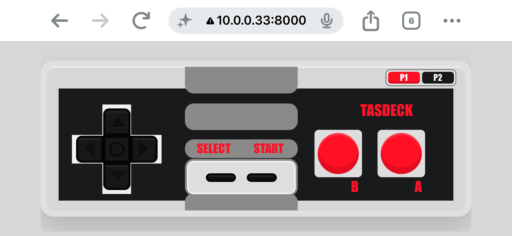

# TASDeck

TASDeck lets you control a real NES from a browser and play tool-assisted speedrun (TAS) files on
real hardware using an Arduino UNO R4. The browser provides live controller input and TAS
controls, a small Node middleware owns the Arduino USB connection, and the firmware drives the NES controller ports.

## Why This Project Exists

Other projects can already play TAS files on real NES hardware, but I wanted something that could run on a single Arduino UNO
R4 board — no physical shift register, breadboard, resistors, or other external components —
with the controller ports wired directly to the Arduino's pins.

## TASDeck In Action

### Main TASDeck Screen


### iPhone Landscape Layout



### Arduino UNO R4 WiFi


## Get Started

Follow the [Installation guide](INSTALL.md) for prerequisites, controller-port wiring, firmware
upload, TAS preparation, and the first real-console run.

Once TASDeck is installed and the firmware is uploaded, start the web app and middleware with:

```sh
npm start
```

Open `http://localhost:8000`, or use one of the printed LAN URLs from a phone on the same network. Rotate the phone to landscape mode for the touch controller view; the layout is designed to feel like a handheld controller for driving the real NES.
Press `Connect` in the web app to open the Arduino USB bridge.

TASDeck supports live controller input from the on-screen controls or keyboard, routes input to NES
port 1 or port 2, and plays pre-generated `.tdmask` streams converted from `.fm2` or `.bk2`
TAS inputs, synchronized to the NES controller latch signal. The event log can capture firmware
traces for diagnosing playback alignment and hardware timing.

Keyboard input uses common NES emulator mapping:

| NES button | Keyboard |
| --- | --- |
| D-pad | Arrow keys |
| `B` | `Z` |
| `A` | `X` |
| `Start` | `Enter` |
| `Select` | `Shift` |

## How It Fits Together

```txt
Browser UI  <-- WebSocket -->  Node middleware  <-- USB serial -->  UNO R4 firmware  -->  NES
```

- `apps/web` contains the dependency-free browser control deck and TAS parsing helpers.
- `scripts/bridge-server.js` serves the app, owns the serial port, and streams hardware TAS data.
- `firmware/uno_r4_wifi` implements the serial protocol and NES controller-port timing.

## Documentation

- [Installation](INSTALL.md) — complete first-time setup, prerequisites, wiring, firmware upload,
  and initial verification.
- [Hardware TAS playback and troubleshooting](docs/hardware-tas-workflow.md) — understand the
  `.tdmask` format and perform advanced trace-based desync diagnosis.
- [Firmware guide](firmware/uno_r4_wifi/README.md) — pin assignments, serial protocol, firmware
  behavior, compilation, upload, and diagnostic builds.
- [Web app guide](apps/web/README.md) — browser controls, middleware connection, TAS playback
  options, event-log tracing, and web-specific test commands.
- [Contributor and agent guide](AGENTS.md) — repository architecture, development constraints,
  testing guidance, and the manual QA checklist.

## Verified TAS Runs

The following runs have completed successfully on real NES hardware with TASDeck:

| Game and run | Time | Link | Hardware |
| --- | ---: | --- | --- |
| Super Mario Bros. — "warps" by HappyLee | 04:57.31 | [1715M](https://tasvideos.org/1715M) | EverDrive N8 Pro |
| Super Mario Bros. — "warpless" by HappyLee & Mars608 | 18:36.78 | [3728M](https://tasvideos.org/3728M) | EverDrive N8 Pro |
| Super Mario Bros. — "Playaround" | 23:30.36 | [User File](https://tasvideos.org/UserFiles/Info/638765452219459600) | EverDrive N8 Pro |
| Super Mario Bros. 2 (FDS / Japan) — "warps, Mario" by HappyLee | 08:04.83 | [3348M](https://tasvideos.org/3348M) | EverDrive N8 Pro |
| Super Mario Bros. 2 — "warps" by Aglar & andrewg | 07:41.16 | [1724M](https://tasvideos.org/1724M) | EverDrive N8 Pro |
| Super Mario Bros. 3 — "warps" by Lord_Tom, Maru & Tompa | 10:24.338 | [3922M](https://tasvideos.org/3922M) | Real cartridge |
| Super Mario Bros. 3 — Lord_Tom & Tompa's NES Super Mario Bros. 3 | 02:54.98 | [4288S](https://tasvideos.org/4288S) | EverDrive N8 Pro |
| Tetris — "maximum score" by r57shell & Archanfel | 02:53.13 | [4853M](https://tasvideos.org/4853M) | EverDrive N8 Pro |
| The Legend of Zelda — Baxter & jprofit22 | 22:38.13 | [1685M](https://tasvideos.org/1685M) | EverDrive N8 Pro |

## Background

TASDeck was inspired by [TASBot](https://tas.bot/),
[NESBot](https://www.instructables.com/NESBot-Arduino-Powered-Robot-beating-Super-Mario-/), and
[VeriTAS](https://github.com/bigbass1997/VeriTAS).

Created by [Chuck Caplan](https://github.com/ChuckCaplan).
