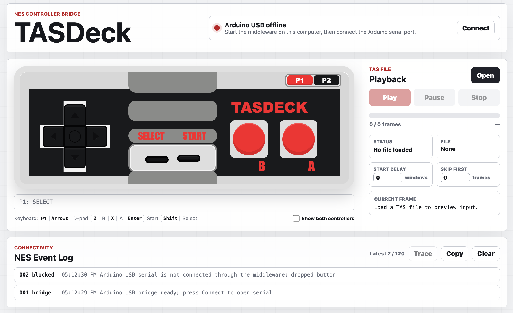
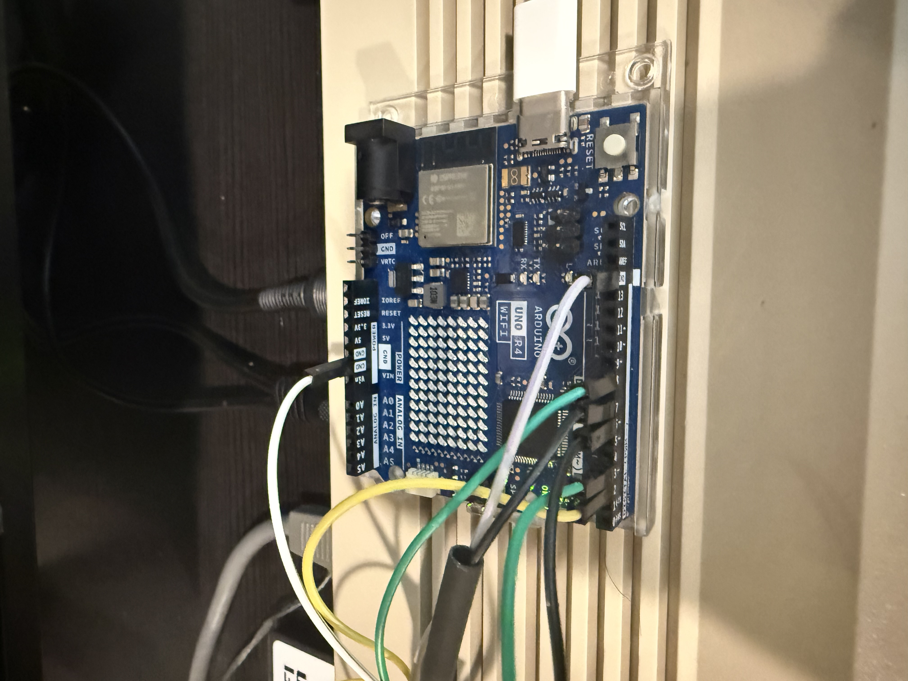

# TASDeck

[](https://github.com/ChuckCaplan/TASDeck/actions/workflows/ci.yml)
[](https://www.youtube.com/@TASDeck)

TASDeck lets you control a real NES from a browser and play tool-assisted speedrun (TAS) files on
real hardware using an Arduino UNO R4. The browser provides live controller input and TAS
controls, a small Node middleware owns the Arduino USB connection, and the firmware drives the NES controller ports.

Every run that has completed on real hardware will be recorded on the
**[TASDeck YouTube channel](https://www.youtube.com/@TASDeck)** — see [Verified TAS Runs](#verified-tas-runs)
for the full list.

## Why This Project Exists

Other projects can already play TAS files on real NES hardware, but I wanted something that could run on a single Arduino UNO
R4 board — no physical shift register, breadboard, resistors, or other external components —
with the controller ports wired directly to the Arduino's pins.

## TASDeck In Action

### Main TASDeck Screen



### Arduino UNO R4 WiFi (Two Controller Ports Connected)



## Get Started

Follow the [Installation guide](INSTALL.md) for prerequisites, controller-port wiring, firmware
upload, TAS preparation, and the first real-console run.

Once TASDeck is installed and the firmware is uploaded, start the web app and middleware with:

```sh
npm start
```

Open `http://localhost:8000`, or use one of the printed LAN URLs from a phone on the same network. Press `Connect` in the web app to open the Arduino USB bridge. Rotate the phone to landscape mode for the touch controller view; the layout is designed to feel like a handheld controller for driving the real NES.

TASDeck supports live controller input from the on-screen controls or keyboard, routes input to NES
port 1 or port 2, and plays versioned `.tdmask` streams or raw `.r08` replay files on a real NES. A
`.tdmask` is generated from an `.fm2` (FCEUX) or `.bk2` (BizHawk) TAS movie using the converter
scripts in `scripts/` (see the [Installation guide](INSTALL.md)) rather than loaded into the web UI
directly; an `.r08` can be played as-is with no conversion, defaulting to a per-strobe mode that
matches default TAStm32 replay semantics.

TASDeck drives standard NES controllers on either port. Zapper, Arkanoid paddle, Power Pad, Four
Score, microphone, and expansion-port input are outside its scope, and the converters reject movies
that use them.

During hardware TAS playback, the on-screen controller lights up the buttons for the selected NES
port. The `Show both controllers` checkbox stacks both input streams vertically, using compact
controllers on larger screens and full-width controllers in phone portrait. The compact phone
landscape view keeps one controller with the P1/P2 selector. A run timer shows elapsed
time and an approximate total for every movie format because real-hardware loading and
no-read gaps can differ from the source movie. The event log can capture firmware traces for
diagnosing playback alignment and hardware timing.

Keyboard input uses the common NES emulator mapping for the selected controller. When both controllers are visible, that mapping controls P1 and a second mapping is enabled for P2:

| NES button | P1 / selected controller | P2 in dual view |
| --- | --- | --- |
| D-pad | Arrow keys | `WASD` |
| `B` | `Z` | `F` |
| `A` | `X` | `G` |
| `Start` | `Enter` | `T` |
| `Select` | `Shift` | `R` |

## How It Fits Together

```txt
Browser UI  <-- WebSocket -->  Node middleware  <-- USB serial -->  UNO R4 firmware  -->  NES
```

- `apps/web` contains the dependency-free browser control deck and TAS parsing helpers.
- `scripts/bridge-server.js` serves the app, owns the serial port, and streams hardware TAS data.
- `firmware/uno_r4_wifi` implements the serial protocol and NES controller-port timing.

## Documentation

- [Installation](INSTALL.md) — complete first-time setup, prerequisites, wiring, firmware upload,
  and initial verification.
- [Hardware TAS playback and troubleshooting](docs/hardware-tas-workflow.md) — understand the
  `.tdmask` and `.r08` formats and perform advanced trace-based desync diagnosis.
- [Firmware guide](firmware/uno_r4_wifi/README.md) — pin assignments, serial protocol, firmware
  behavior, compilation, upload, automatic per-mode interrupt paths, and diagnostic builds.
- [Web app guide](apps/web/README.md) — browser controls, middleware connection, TAS playback
  options, event-log tracing, and web-specific test commands.
- [Contributor and agent guide](AGENTS.md) — repository architecture, development constraints,
  testing guidance, and the manual QA checklist.

## Verified TAS Runs

The following runs have completed successfully on real NES hardware with TASDeck:

| Game and run | Time | TAS Link | Original Format | Hardware |
| --- | ---: | --- | --- | --- |
| [Arkanoid — "warpless" by eien86](https://www.youtube.com/watch?v=_Aq-DNFsMJ8) | 10:56 | [5327M](https://tasvideos.org/5327M) | `.bk2` | EverDrive N8 Pro |
| [Chip 'n Dale Rescue Rangers — 2 players by dragonxyk](https://www.youtube.com/watch?v=FdtvpdCli3k) | 09:33 | [1128M](https://tasvideos.org/1128M) | `.r08` | EverDrive N8 Pro |
| [Disney's The Little Mermaid by McBobX](https://www.youtube.com/watch?v=6GE6xpsqm-g) | 06:41.32 | [3298M](https://tasvideos.org/3298M) | `.fm2` | EverDrive N8 Pro |
| [Donkey Kong — "all items" by Phil, Spikestuff, GoddessMaria & Alyosha](https://www.youtube.com/watch?v=I4crTwfEUwo) | 01:16 | [5254M](https://tasvideos.org/5254M) | `.bk2`, `.r08` | EverDrive N8 Pro |
| [Double Dragon by Alyosha](https://www.youtube.com/watch?v=wcYWtg0kqyw) | 08:52 | [3211M](https://tasvideos.org/3211M) | `.r08` | EverDrive N8 Pro |
| [Double Dragon II — 2 players by Xipo](https://www.youtube.com/watch?v=VIkQfI6XHhE) | 08:23 | [2607M](https://tasvideos.org/2607M) | `.r08` | EverDrive N8 Pro |
| [Ghosts 'n Goblins by Arc & Koh1fds](https://www.youtube.com/watch?v=YX-PX36qvdo) | 08:07.55 | [3173M](https://tasvideos.org/3173M) | `.fm2` | EverDrive N8 Pro |
| [Lode Runner by adelikat](https://www.youtube.com/watch?v=AQCvccbO2ls) | 17:42 | [4559M](https://tasvideos.org/4559M) | `.r08` | EverDrive N8 Pro |
| [Mike Tyson's Punch-Out!! by adelikat](https://www.youtube.com/watch?v=KTQPddGjbb8) | 17:35 | [1695M](https://tasvideos.org/1695M) | `.r08` | EverDrive N8 Pro |
| [Monopoly by adelikat](https://www.youtube.com/watch?v=MBKtSSF3uyc) | 00:31 | [4104M](https://tasvideos.org/4104M) | `.r08` | EverDrive N8 Pro |
| [Pac-Man (Tengen) by eien86](https://www.youtube.com/watch?v=ke553evnN2I) | 12:04 | [5231M](https://tasvideos.org/5231M) | `.bk2` | EverDrive N8 Pro |
| [Super Mario Bros. — "warps" by HappyLee](https://www.youtube.com/watch?v=wT-2EFStFg0) | 04:57.31 | [1715M](https://tasvideos.org/1715M) | `.fm2` | EverDrive N8 Pro |
| [Super Mario Bros. — "warpless" by HappyLee & Mars608](https://www.youtube.com/watch?v=JpjCpAvx-Nk) | 18:36.78 | [3728M](https://tasvideos.org/3728M) | `.fm2` | EverDrive N8 Pro |
| [Super Mario Bros. — "Playaround" by flamexx](https://www.youtube.com/watch?v=OOrngcD9NOQ) | 23:30.36 | [User File](https://tasvideos.org/UserFiles/Info/638765452219459600) | `.fm2` | EverDrive N8 Pro |
| [Super Mario Bros. — "maximum score" by HappyLee, DaSmileKat, Kzwbz, Asumeh & Kosmic](https://www.youtube.com/watch?v=NeRRpmQHe9o) | 19:01 | [6555M](https://tasvideos.org/6555M) | `.r08` | EverDrive N8 Pro |
| [Super Mario Bros. 2 (FDS / Japan) — "all items, Mario" by Kzwbz, Argentu-M & Endless Wind](https://www.youtube.com/watch?v=roWEV2iQf7M) | 23:33 | [5049M](https://tasvideos.org/5049M) | `.fm2` | EverDrive N8 Pro |
| [Super Mario Bros. 2 (FDS / Japan) — "warps, Mario" by HappyLee](https://www.youtube.com/watch?v=oDotKGDbRio) | 08:04.83 | [3348M](https://tasvideos.org/3348M) | `.fm2` | EverDrive N8 Pro |
| [Super Mario Bros. 2 (FDS / Japan) — "SMB2J ACE Total Control example", 2 controllers by threecreepio](https://www.youtube.com/watch?v=bP5bhUHO9tk) | 14:44 | [GitHub](https://github.com/threecreepio/smb2j-ace-tc) | `.fm2` | EverDrive N8 Pro |
| [Super Mario Bros. 2 (USA) — "warpless" by Aglar, andrewg & Alyosha](https://www.youtube.com/watch?v=u-r19EgH4cY) | 18:24 | [6366M](https://tasvideos.org/6366M) | `.bk2` | EverDrive N8 Pro |
| [Super Mario Bros. 2 (USA) — "warps" by Aglar & andrewg](https://www.youtube.com/watch?v=YYqVx4bTyT8) | 07:41.16 | [1724M](https://tasvideos.org/1724M) | `.fm2` | EverDrive N8 Pro |
| [Super Mario Bros. 3 — "all levels" (100%) by Lord_Tom & Tompa](https://www.youtube.com/watch?v=cB5zRV_KQ60) | 01:04:37 | [2835M](https://tasvideos.org/2835M) | `.fm2` | EverDrive N8 Pro |
| [Super Mario Bros. 3 — "warps" by Lord_Tom, Maru & Tompa](https://www.youtube.com/watch?v=gfD4Rx75C1g) | 10:24.338 | [3922M](https://tasvideos.org/3922M) | `.fm2` | Real cartridge |
| [Super Mario Bros. 3 — "game end glitch" by Lord_Tom & Tompa](https://www.youtube.com/watch?v=A12l7o14aHw) | 02:54.98 | [4288S](https://tasvideos.org/4288S) | `.fm2` | Real cartridge & EverDrive N8 Pro |
| [Tetris — "maximum score" by r57shell & Archanfel](https://www.youtube.com/watch?v=A2dBl0pKB0A) | 02:53.13 | [4853M](https://tasvideos.org/4853M) | `.fm2` | EverDrive N8 Pro |
| [The Legend of Zelda — 2 controllers by Baxter & jprofit22](https://www.youtube.com/watch?v=go0Gdj3tPLY) | 22:38.13 | [1685M](https://tasvideos.org/1685M) | `.fm2` | EverDrive N8 Pro |
| [The Legend of Zelda — "Swordless Challenge", 2 controllers by Lord_Tom](https://www.youtube.com/watch?v=i4vA6L4wWBU) | 24:39.71 | [3289M](https://tasvideos.org/3289M) | `.fm2` | EverDrive N8 Pro |
| [Tiger-Heli by adelikat & ThunderAxe31](https://www.youtube.com/watch?v=YqREIOvE25Y) | 12:54 | [5037M](https://tasvideos.org/5037M) | `.r08` | EverDrive N8 Pro |

## Background

TASDeck was inspired by [TAStm32](https://github.com/Ownasaurus/TAStm32), [TASBot](https://tas.bot/),
[NESBot](https://www.instructables.com/NESBot-Arduino-Powered-Robot-beating-Super-Mario-/), and
[VeriTAS](https://github.com/bigbass1997/VeriTAS).

Created by [Chuck Caplan](https://github.com/ChuckCaplan).
